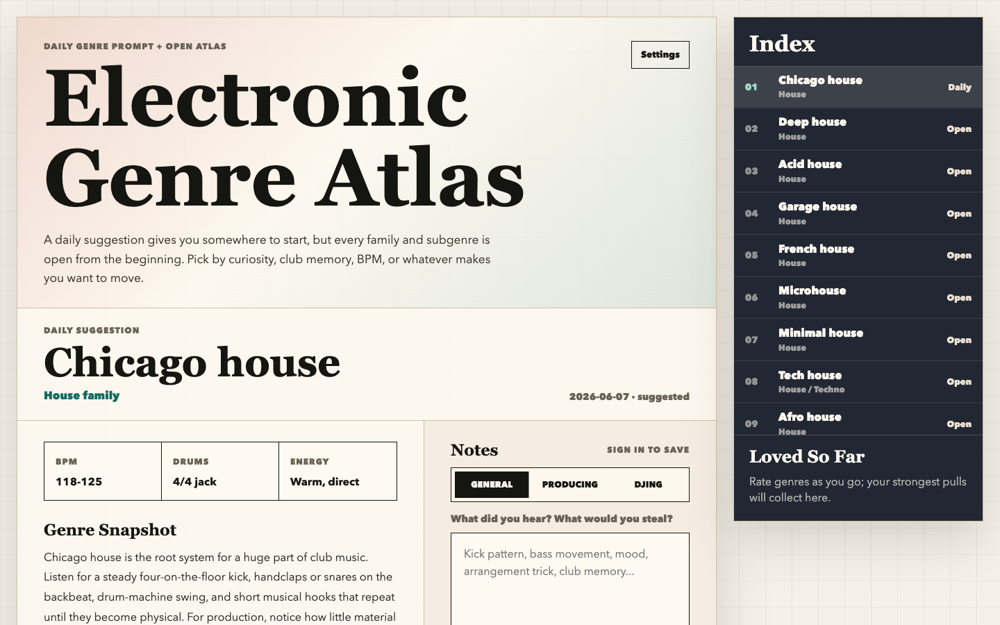

# Electronic Genre Atlas

A small daily listening atlas for electronic music producers and DJs, with notes, Spotify references, and lightweight Python/SQLite sync.



Electronic Genre Atlas gives you one electronic music genre prompt each day, while keeping the full atlas open for browsing. It is meant for practical listening: hear the drums, note the bass movement, collect production ideas, and remember what pulled you in.

## Why I Built It

I wanted a focused way to study electronic music without turning discovery into an endless search session. The product is intentionally small: one daily suggestion, 50 genre entries, reference tracks, Spotify playlist links, notes, ratings, and a simple sync model.

The project also reflects how I like to build: start from a real personal workflow, make the interaction feel specific to the domain, keep the stack understandable, and add just enough infrastructure to make it reliable.

## What It Shows

- Product judgment: daily prompt plus open browsing, so the app gives direction without locking the user in.
- Taste and domain fit: a visual style closer to a printed music reference than a generic dashboard.
- Practical systems thinking: vanilla JS, Python standard library, SQLite, Caddy examples, CSP headers, backups, and conflict-aware state merging.
- Reliability habits: focused tests for state coercion, sync conflict behavior, import idempotency, and the basic HTTP API.
- AI-assisted workflow: coding agents are useful here for review, test scaffolding, and repo hygiene, but the product decisions, architecture, privacy boundary, and final verification remain owned by me.

## Quick Start

```sh
make dev
```

Then open:

```text
http://127.0.0.1:8090
```

Run checks:

```sh
make test
make smoke
```

The local dev server uses `/tmp/electronic-genre-atlas.sqlite3` by default and sets an insecure cookie so username sync works on local HTTP.

## Architecture

- `index.html`, `styles.css`, `sync-app.js`: the browser app.
- `genres-data.js`: the atlas content and listening references.
- `server.py`: a small Python HTTP API and static-file server for local development.
- `test_server.py`: unit and API tests for the sync/storage behavior.
- `deploy/`: redacted deployment examples for Caddy, systemd, backups, and Docker Compose.
- `AGENTS.md`: repo map and operating rules for code agents reviewing or editing this project.

The backend stores users, sessions, imports, and state revisions in SQLite. When a stale device saves, the server merges notes, listening status, playlist-opened state, ratings, and progress instead of blindly overwriting the newer state.

## Privacy Boundary

Username-only sync is intentionally simple and is not private authentication. Anyone who knows a username can open that account. Do not use this app for private notes, personal data, client information, or anything sensitive.

The public repository keeps deployment files as examples only. Real hostnames, tunnel IDs, private server aliases, and live database paths should stay out of git.

## Deployment Notes

For a local public-style run, use:

```sh
python3 server.py --db /tmp/electronic-genre-atlas.sqlite3 --host 127.0.0.1 --port 8090 --static-dir . --insecure-cookie
```

For self-hosting, adapt the files in `deploy/`. The intended production shape is:

```text
HTTPS edge or tunnel -> Caddy on localhost -> Python API on localhost -> SQLite
```

If a live demo is exposed publicly, add it to the GitHub repository website field only after deciding that the username-only sync boundary is acceptable for public visitors.
